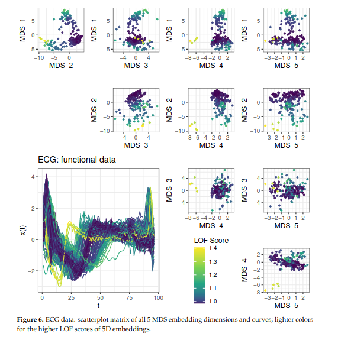

Last update: `r Sys.Date()`

Please contact [Fabian Scheipl](mailto:fabian.scheipl@stat.uni-muenchen.de) if you're interested in one of these BA or MA thesis topics or if you want to discuss (related) ideas of your own.  
For BA theses, we would keep the focus on refactoring, evaluating and describing existing implementations and/or applying them to real data, for MA theses either novel developments with detailed theory along with clean and performant implementations would be expected, or challenging analyses of more complex data sets with advanced methods.

 
# Topic Area: Improving `tidyfun` and related packages

[`tidyfun`](https://tidyfun.github.io/tidyfun/) is an `R` package for functional data analysis currently under development. Some of the issues tracked on Github for this and its underlying infrastructure package [`tf`](https://github.com/tidyfun/tf) could also be good topics for theses could also be good topics for
theses: see [here](https://github.com/tidyfun/tf/issues) or [here](https://github.com/tidyfun/tidyfun/issues).
  

### Topic: Implementing and comparing functional principal component-based representations for functional data (BA/MA)

Functional data $x_i(t)$ can be represented very efficiently in terms of their eigenfunctions (*functional principal components*: FPCs), but this requires estimating the auto-covariance function $\text{Cov}(x_i(t), x_i(t'))$ from potentially noisy and/or partially missing data. The functional data literature contains a multitude of proposals on how to do so.  
In this topic you will identify and describe the most important different algorithms, (re-)implement some of them for use in `tf` (or: write glue code to integrate existing implementations into `tf`), and compare their performance in an extensive benchmark study on real and synthetic data sets.

The topic is suitable for a wide range of programming skills and scientific ambitions.
If both are high, this topic can even be extended to something that could result in a publication,  especially if extended to FPC representations for non-Gaussian data like [Dey et al., 2024](https://doi.org/10.1002/sim.10240), or to NN-based covariance estimators like [Sarkar et al., 2022](https://doi.org/10.1111/rssb.12551).

### Topic: Implementing and comparing quantile methods for functional data (BA/MA)

The functional data literature contains many possible definitions of "function-valued quantiles". We would pick out some of the most relevant/interesting of these, summarize the relevant theory behind them, implement them for use within `tidyfun`, and perform a comparison based on real and/or synthetic data sets.

A minimal BA thesis in this topic area would be re-implementing, documenting and validating (most of) the methods in the [`rainbow`](https://cran.r-project.org/web/packages/rainbow/index.html) package integrated into / as an add-on package for `tf` & `tidyfun`. 

<!-- 
### Topic: Implementing and comparing registration/alignment methods (BA/MA)

Functional data contains both vertical (amplitude - how large is the peak/valley) and horizontal (phase - where is the peak/valley) variability. The latter requires more sophisticated mathematical theory and complex algorithms to deal with. Potential tasks here include:

- defining & implementing additional data structures, classes & methods to represent & visualize aligned functions along with their corresponding warping functions
- writing glue code for using registration packages like [fdasrvf](https://github.com/jdtuck/fdasrvf_R), [registr](https://github.com/julia-wrobel/registr), [DTW](https://cran.r-project.org/web/packages/dtw/index.html) methods with `tf` vectors  
- ... or (re-)implementing (simpler) alignment methods (like `fda`'s landmark alignment or alignment based on FPC 1 ("continuous registration"))
- implementation of summary statistics, visualizations, diagnostics etc for the results of registration/alignment procedures

Stretch goals here include implementing methods for noisy and/or sparse and/or non-Gaussian/discrete functional data and accommodating functional fragments/unequal domains with functions of different observed lengths.
Excellent review of (mostly) SRVF framework: [Wu et al (2023, ch. 3 f)](https://link.springer.com/article/10.1007/s11749-023-00876-9) 
--> 

### Topic: Implementing multivariate functions in `tf` (MA, maybe BA) 

Extend `tf`-classes and methods for multivariate functions with vector outputs: $f:\mathbb R \to \mathbb R^d$ for $d>1$.

This is a large SWE task - scope would probably be limited to extending either the `tfd` or `tfb` classes, and may require some major refactoring of `tf` to make such an extension work smoothly and consistently (e.g. it probably requires defining new classes and logic for function `domain`s).

### Topic: Representation and computation for probability densities in Bayes space (BA, maybe MA)  

The *Bayes Space* paradigm developed by v.d. Boogart, Hron, Egozcue and others
(e.g. [v.d. Boogart et al. (2014)](https://onlinelibrary.wiley.com/doi/abs/10.1111/anzs.12074), [Hron et al. (2016)](https://doi.org/10.1016/j.csda.2015.07.007)) provides a way to represent probability measures so that
their addition and multiplication are well defined, enabling simple summary statistics (means etc) as well as methods such as PCA or linear regression for probability-density-valued data -- i.e. the unit of observation is represented by an entire probability distribution, not a single value, and the inferential goal is typically to understand how other covariates are associated with changes in these distributions. This has many interesting applications, for example see [Meier et al.  (2021)](https://arxiv.org/abs/2110.11771) for differential effects of family formation on gender-specific income distributions in East and West Germany or [Menafoglio et al. (2021)](https://doi.org/10.1016/j.spasta.2021.100494) for an application to groundwater monitoring.  
A thesis on this topic would

- summarize the necessary theoretic background and literature
- implement functionality for `tf` and  `tidyfun` that represents density data and performs arithmetic operations as well as basic statistics in Bayes space (e.g. also implement suitable ZB-Splines, see [Skorna et al (2024)](https://arxiv.org/pdf/2405.11615)
- apply this to an interesting real-world data set (or: replicate a published analysis in this context with the new implementation).

<!--
### Topics: Write `tidyfun` scripts for Craniceanu et al's "Functional Data Analysis with R" / Ramsay et als's "Functional Data Analysis with R and MATLAB" (BA)

Both of these books contain many chapters, data sets and case studies that could also be done (mostly) using `tidyfun`  and/or `refund`.  
We'll select some of them, you'll identify and implement missing functionality in `tidyfun` with my help, and write them up with all the necessary theoretical background and some extensions, in an online document / as vignettes for `tidyfun`.

Books: [Craniceanu et al. (2024)](https://functionaldataanalysis.org/), [Ramsay et al. (2009)](https://dx.doi.org/10.1007/978-0-387-98185-7)
-->

<!-- 
# Topic: Registration based on Peak-Persistence Diagrams (MA, BA very maybe)

Summarize, implement & evaluate SRVF-based function registration using the peak-persistence diagrams of [Kim, Dasgupta, Srivastava (2023)](https://arxiv.org/pdf/2305.04826.pdf). 
This topic would involve some more advanced and interesting maths and algorithms like differential geometry, topology, dynamic programming optimization. The paper to implement is bleeding edge state of the art, so this makes an excellent topic for people considering a PhD and looking for a thesis topic that might turn into something publishable. Potential tasks would include:

- summarizing the maths behind these methods
- implementation of the algorithms and visualizations from the paper in R, preferably using infrastructure of / integrated into  `tf`/`tidyfun`
- benchmarking against other registration approaches available in R
- application to real world datasets (e.g. mouse brain stem audiograms, bodyweight fitness movement patterns, ...)

Stretch goals would include extending this to either non-Gaussian/discrete functional data or accommodating functional fragments/unequal domains with functions of different observed lengths, based on ideas we'd develop together.
--> 

## Topic: Functional Data Representation with Merge Trees (MA)

[Pegoraro & Secchi (2023)](https://arxiv.org/pdf/2108.13147) develop representations of (noisy, heterogenous) functional data that are invariant to misalignment, i.e. representations that are suitable for comparing and analyzing the shapes of unregistered curves while discarding even fairly complex phase variability. 
In this thesis, you would summarize the relevant mathematical background, implement the techniques from the paper in `R` & evaluate them on some data.  
This topic involves quite advanced and interesting mathematics from topology, metric spaces, and graph theory as well as differential geometry. The paper to implement is state of the art, so this makes an excellent topic for people considering staying in academia and looking for a thesis topic that might turn into something publishable, especially if any of the stretch goals below become part of the thesis. 

Tasks would include:

- summarizing/explaining the maths behind the method
- re-implementing the algorithms and visualizations from the paper in `R`, preferably using infrastructure of / integrated into  `tf`/`tidyfun`
- benchmarking against similar approaches available in `R`
- evaluation of the performance on real world datasets (e.g. mouse brain stem audiograms, bodyweight fitness movement patterns, story arc data, ...)

Stretch goals could include developing a variant of [Kim, Dasgupta, Srivastava (2023)](https://arxiv.org/pdf/2305.04826.pdf) based on merge trees instead of peak persistence diagrams or accommodating functional fragments/unequal domains with functions of different observed lengths.

## Topic: Testing for missingness patterns in incomplete functional data (BA)

[Ofner et al. (2025)](https://arxiv.org/pdf/2505.08721) suggest statistical testing procedures for checking whether the occurence, lengths and locations of gaps in incomplete functional data are related to the unobserved values of the functions (i.e., testing for missing-not-at-random *MNAR* vs missing-(completely)-at-random *M(C)AR*).   
In this thesis, you would summarize the relevant statistical background, implement the techniques from the paper in `R` & evaluate their performance on some real and/or synthetic data. 

# Topic Area: Improving `manifun` (BA/MA)

[`manifun`](https://github.com/HerrMo/manifun) is a small, unpublished `R` package for dimension reduction and embedding visualization (primarily) for functional data. Possible tasks include implementing suitable interfaces to `mlr3` and/or [`tidyfun`](https://github.com/tidyfun/tidyfun). 
*Implementing AUMVC framework* could be included in this topic area as well. 

### Topic:  Improved interactive visualization of functional data embeddings (MA)

The central goal of the project is to improve existing and implement new embedding (i.e. dimension reduction) visualization approaches. Fairly flexible, interactive versions of the kind of visualization shown below: 

that includes e.g. tooltips/interactive highlighting when hovering over specific data points, brushing for selecting and highlighting specific embedding regions or curves, etc have already been implemented in a previous MA thesis [(`EmbedIt`, Jennert 2023)](https://jukaje.shinyapps.io/Embed_it2/).

Thesis goals could include:

- Re-implementing `EmbedIt` based on more performant software like D3.js or refactoring it for better responsiveness etc
- Adding interactive 3D visualizations
- Implementing a "grand tour" and other classic multivariate exploration tools (c.f. [`tourr`](https://ggobi.github.io/tourr/))
- Adding pre-processing and embedding steps to the existing app
- Writing up interesting case studies based on real world datasets (e.g. mouse brain stem audiograms, bodyweight fitness movement patterns, story arc data, ...)

# Topic Area: (FDA) Outlier Detection

Beyond the methodological/theoretical topics below, we could develop more applied thesis topics in this context together with external partners that deal with large functional data sets such as the German Mouse Clinic (e.g. [auditory brain stem response curves](https://zenodo.org/records/5779876)) or with (partners of) Prof. Christian Müller's group at the Institute of Statistics.

<!-- 
### Topic: Realistic functional outlier benchmark datasets (BA)

Realistic evaluation of outlier detection should use real datasets with real outliers. Usually, this is done by selecting all majority class observations from a labeled dataset and contaminating them with a few randomly sampled instances from other minority classes. This approach yields "false" negatives/positives unless the minority class is really sufficiently and consistently different from the majority class observations. The goal of this project is to investigate under which circumstances this "unless" applies by comparing two approaches:

-   use only datasets from the `mlr-fda` classification benchmark ([pdf](https://arxiv.org/pdf/1911.07511.pdf)) that were predicted very accurately to generate outlier detection benchmark data
-   for the generated benchmark datasets, use detailed observation-level `mlr-fda` benchmark results to pick only those minority (and maybe also majority?) class observations that were consistently labeled correctly

Additionally, we are interested in how these results are affected by measures of dataset structure like separability ( [pdf](https://arxiv.org/pdf/2109.05180.pdf)) and intrinsic dimensionality ([pdf](https://arxiv.org/pdf/2109.02596.pdf), [CRAN](https://cran.r-project.org/web/packages/intrinsicDimension/index.html)).
-->

### Topic: Implementing the AUMVC framework (MA)

The area-under-the-mass-volume-curve (AUMVC, [pdf](https://arxiv.org/abs/1607.01152)) can be used to tune outlier detection algorithms. Yet, a major caveat is that it relies on MC simulations for approximating integrals and is thus not applicable to high-dimensional settings. Combining it with dimension reduction and manifold learning may allow to solve this issue.\
The goal of this project is to implement the AUMVC framework in `manifun` and to conduct initial experiments. The central questions to be answered are:

-   How robust is the AUMVC approach to the ambient dimensionality of the data? This could be assessed by comparing results on image and functional data.
-   A further question, which may be investigated: are there any distance measures for complex data such as images, which can be used to induce suitable bias for AUMVC to work on (embeddings of) such data?
- stretch goal: can AUMVC be adapted to sample only from the *relevant* space so it scales better to (nominally) high-dimensional data? e.g. by simulating data uniformly from the (convex hull) of the observed data or from lower dimensional (but: almost losslessly compressed) representations/embeddings of the data?  

### Topic: Criterion for structural outlyingness (BA)

Multi-dimensional scaling (MDS) can be used to represent the outlier structure of functional datasets ([pdf](https://arxiv.org/abs/2109.06849)). However, MDS embeddings represent the entire data structure (... *hopefully*, at least), not *just* structural outlyingness. Since MDS embedding dimensions are sorted by decreasing amount of "explained structure", this might lead to components of structural outlyingness being represented only in "late" embedding dimensions in datasets with few outliers and complex structured variation of high rank.  
You would develop and evaluate a procedure for identifying embedding dimensions (or 2D-subspaces of such embeddings) in which structural outlyingness is reflected, i.e. the goal is to find relevant (combinations of) embedding dimensions for outlier visualization/detection (and, possibly, for tuning AUMVC if embeddings are too high-dimensional, see below). Possible approaches:

-   use something like HiCS ([Link](https://ieeexplore.ieee.org/abstract/document/6228154); this is computationally heavy)
-   run Local Outlier Factor (LOF) or similar methods on each 2D-subspace and pick the ones where upper-tail (!) dependencies with global LOF scores are maximal -- "upper-tail" only because the strength of association between global LOF scores and corresponding subspace LOF scores for low/intermediate values is irrelevant for this issue.

### Topic: Multivariate Functional Outlier Visualization and Detection (BA)

Replicate the simulation study and application examples of [Aléman-Gomez et al. (2021)](https://onlinelibrary.wiley.com/doi/pdf/10.1002/sim.9342) based on a less arbitrary [geometrical-topological approach](https://arxiv.org/pdf/2109.06849) and compare results.

# Topic Area: Cluster Analysis

<!--
## Quantifying Separability (MA)

Cluster analysis can be regarded as a topological problem where the aim is to separate the data into connected components [(Niyogi et al, 2016)](https://epubs.siam.org/doi/abs/10.1137/090762932). However, when exactly clusters can be considered ("clearly") separable remains an important open question. For example, while the manifold learning method UMAP considerably improves clusterings (smaller intra-cluster distances, larger inter-cluster distances) if (high-dimensional) data is distributed in "clearly" separable clusters, the situation is less clear in situations with very close or even overlapping clusters. Being able to assess and quantify the separability of a dataset, i.e. specify when exactly clusters can be considered "clearly" separable, is thus of great interest.\
The focus of this project is to gain a profound understanding of the concept of separability and its implications for cluster analysis. A possible project outline includes:

-   devise and set up suitable and systematic synthetic experiments to obtain an understanding of the problem. For example, separability may be defined
    -   as a function of means and (co)variances of the underlying data generating processes
    -   or with regard to structures and patterns of the within- and between-cluster distances
    -   or patterns in persistent homology diagrams developed in topological data analysis
-   apply measures of separability (see [ArXiv Link](https://arxiv.org/pdf/2109.05180.pdf)) on these settings and investigate if they reliably quantify a dataset's separability
-   benchmark manifold learning and cluster detection methods on the synthetic settings and investigate connections to the separability measures
-   "categorize" a diverse collection of real data sets with respect to separability
--> 

## Topic: Embedding-based cluster analysis of overlapping / fuzzy clusters (MA)

Both UMAP and t-SNE, state-of-the-art manifold learning methods, can be used to detect and represent the cluster structure of complex, high-dimensional data. However, which method is more suitable for the task (or specific aspects of the task) under which conditions remains an open question. Answering this question is complicated since several hyperparameters need to be tuned for both methods and the underlying task is unsupervised (i.e., tuning is hard...).\
While there are indications that UMAP leads to "better" clusterings (smaller intra-cluster distances, larger inter-cluster distances) when high-dimensional data consists of clearly separate clusters, the situation is less clear in situations with very close or even overlapping clusters. The focus of this project is to assess the latter setting and tasks include the following:

-   set up extensive synthetic experiments to obtain an initial understanding of the problem. Possible factors to assess:
    -   Overlap/Separability as a function of mean and variance of the underlying data generating processes
    -   Parameter sensitivity w.r.t. to dimensionality and number of observations
    -   Relevant parameters for improving separability
-   investigate whether measures of separability ([pdf](https://arxiv.org/pdf/2109.05180.pdf)) can be used to reliably infer the structure of data set

# Topic Area: Regression Models with/for functional data

## Simultaneous, auto-correlation-corrected confidence bands for functional regression coefficients (BA, MA possible with some extensions)

Confidence intervals for `refund`'s functional regression models estimated by `pffr` rely on very restrictive assumptions about model residuals and are only valid point-wise, not simultaneously across the function. Therefore, they are inappropriate in many applications and tend to yield over-optimistic results.  
For this thesis, you would implement [Liebl & Reimherr's (2020)](https://link.springer.com/chapter/10.1007/978-3-030-47756-1_21) proposal for fast and fair simultaneous CIs for `pffr`-fits and compare its operating characteristics to bootstrap-based and conventional alternatives. 

## Refactoring `refund::pffr` & `refund::pfr` (MA)

These fairly old and rather badly written functions implement very general classes of penalized regression models (GAMs and GAMMs) for functional responses and/or predictors. Your thesis would be to re-write them from scratch with my help, using best practices for R programming like proper unit tests, input validation, and extensive documentation. This could also include developing a more stream-lined, consistent formula interface and developing better methods to deal with factor covariates and interaction effects as well as writing up some interesting case studies to be published as a vignette accompanying the package.
See [Scheipl & Greven (2017)](https://doi.org/10.1177/1471082X16681317) for a review of the underlying methodology.

