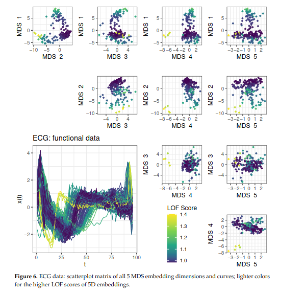

Last update: `r Sys.Date()`

Please contact [Fabian Scheipl](mailto:fabian.scheipl@stat.uni-muenchen.de) if you're interested in one of these BA or MA thesis topics or if you want to discuss (related) ideas of your own.  
For BA theses, we would keep the focus on refactoring, evaluating and describing existing implementations and/or applying them to real data.  
For MA theses, either novel developments with detailed theory along with clean and performant implementations would be expected, or more challenging analyses of more complex data sets with advanced methods.

## Overview

```{r topic-table, echo=FALSE, message=FALSE}
library(tidyverse)
library(knitr)

rmd_lines <- readLines("README.Rmd")

# Track comment blocks and parse headers
in_comment <- FALSE
current_area <- NA_character_
topics <- tibble(area = character(), title = character(), degree = character(),
                 header_raw = character())

for (i in seq_along(rmd_lines)) {
  line <- rmd_lines[i]
  if (str_detect(line, "<!--")) in_comment <- TRUE
  if (str_detect(line, "-->")) { in_comment <- FALSE; next }
  if (in_comment) next

  # Topic Area headers (# Topic Area: ...)
  if (str_detect(line, "^#\\s+Topic Area:")) {
    current_area <- str_extract(line, "(?<=Topic Area:\\s).*") |> str_trim()
  }

  # Individual topic headers (## or ###) with degree designation
  if (str_detect(line, "^#{2,3}\\s+.*\\([^)]*(?:BA|MA)[^)]*\\)")) {
    header <- str_remove(line, "^#{2,3}\\s+(Topic:\\s*)?")
    degree <- str_extract(header, "\\([^)]+\\)\\s*$") |> str_remove_all("[()]")
    title <- str_remove(header, "\\s*\\([^)]+\\)\\s*$")
    topics <- add_row(topics, area = current_area, title = title, degree = degree,
                      header_raw = str_remove(line, "^#{2,3}\\s+"))
  }
}

# Generate GitHub-style anchor slugs
make_anchor <- function(header) {
  header |>
    str_to_lower() |>
    str_replace_all("\\s+", "-") |>
    str_replace_all("[^a-z0-9-]", "") |>
    str_replace_all("-+", "-") |>
    str_remove("^-|-$")
}

# Deduplicate Topic Area column (blank after first occurrence)
topics <- topics |>
  mutate(
    area_display = if_else(area != lag(area, default = ""), area, ""),
    anchor = make_anchor(header_raw),
    topic_link = paste0("[", title, "](#", anchor, ")")
  )

topics |>
  select(`Topic Area` = area_display, Topic = topic_link, `Suitable for` = degree) |>
  kable()
```

# Topic Area: Improving `tidyfun` and related packages

[`tidyfun`](https://tidyfun.github.io/tidyfun/) is an `R` package for functional data analysis currently under development. Some of the issues tracked on Github for this and its underlying infrastructure package [`tf`](https://github.com/tidyfun/tf) could also be good topics for
theses: see [here](https://github.com/tidyfun/tf/issues) or [here](https://github.com/tidyfun/tidyfun/issues).
  

### Topic: Implementing and comparing functional principal component-based representations for functional data (BA/MA)

Functional data $x_i(t)$ can be represented very efficiently in terms of their eigenfunctions (*functional principal components*: FPCs), but this requires estimating their auto-covariance function $\text{Cov}(x_i(t), x_i(t'))$ from potentially noisy and/or partially missing data. The functional data literature contains a multitude of proposals on how to do so (E.g. [Shang (2014)](https://link.springer.com/article/10.1007/s10182-013-0213-1) provides a slightly out-of-date review of background and basic approaches.).     
For your thesis, you will describe the most important algorithms, (re-)implement some of them for use in `tf` (or: write glue code to integrate existing implementations into `tf`), and compare their performance in an extensive benchmark study on real and synthetic data sets.

The topic is suitable for a wide range of programming skills and scientific ambitions.
If both are high, this topic can even be extended to something that could result in a publication,  especially if extended to FPC representations for non-Gaussian data like [Dey et al., 2024](https://doi.org/10.1002/sim.10240), or to NN-based covariance estimators like [Sarkar et al., 2022](https://doi.org/10.1111/rssb.12551).

### Topic: Fast covariance estimation via the TReK algorithm (MA)
Estimating the auto-covariance function $\text{Cov}(x_i(t), x_i(t'))$ from noisy and/or sparse functional data is often the main computational bottleneck for FPCA. The TReK (Tensorized-and-Restricted Krylov) algorithm [(Yun & Panaretos, 2025)](https://arxiv.org/abs/2501.08265) is a recent approach that aims to be both fast and memory-efficient for sparse designs.

In this thesis, you would:

- summarize the core idea of the TReK algorithm and its assumptions
- implement TReK-style covariance estimation for `tf` objects (with careful numerical tests)

Extensions could include multivariate functional data, adaptive tuning/bandwidth selection, and/or more extensive investigations of robustness to sampling designs.

### Topic: Markov-regularized covariance estimation for functional data (MA)

Estimating covariance functions is a central bottleneck in functional data analysis, especially for prediction, kriging, FPCA, and regression methods that require stable inversion of the covariance operator. A recent proposal by [Naepels & Panaretos (2026)](https://arxiv.org/abs/2604.18229) replaces classical smoothness assumptions by a Markov constraint on the functional covariance structure: for Gaussian processes, Markovianity induces a low-dimensional shape constraint on the covariance kernel and corresponds, on finite grids, to a tridiagonal precision matrix. In this thesis, you would summarize the Markov-transform estimator and its assumptions, implement it for regular and irregular `tf` objects, and benchmark it against empirical, smoothed, and FPCA/PACE-style covariance estimators. A central question would be whether Markov-regularized covariance estimation is useful beyond exactly Markov processes, especially for inverse-covariance-driven tasks such as kriging, curve completion, and prediction from sparse observations. A natural extension would be to develop shrinkage estimators interpolating between a conventional covariance estimator and its Markov projection, allowing a data-adaptive bias--variance tradeoff under model misspecification. The thesis would combine theory, careful `R` implementation, and simulation studies varying sampling density, noise level, degree of Markov misspecification, and downstream task performance.

### Topic: Implementing and comparing quantile methods for functional data (BA/MA)

The functional data literature contains many possible definitions of "function-valued quantiles", e.g. [(Arribas-Gil & Romo, 2014)](https://arxiv.org/abs/1306.1718), [(Gijbels & Nagy, 2017)](https://projecteuclid.org/journals/statistical-science/volume-32/issue-4/On-a-General-Definition-of-Depth-for-Functional-Data/10.1214/17-STS625.full). We would pick out some of the most relevant/interesting of these, summarize the relevant theory behind them, implement them for use within `tidyfun`, and perform a comparison based on real and/or synthetic data sets.

A minimal BA thesis in this topic area could be re-implementing, documenting and validating (most of) the methods in the [`rainbow`](https://cran.r-project.org/web/packages/rainbow/index.html) package integrated into / as an add-on package for `tf` & `tidyfun`.  
MA theses about this topic would go deeper into the theory of functional data depths [(e.g. Nieto-Reyes & Battey, 2018)](https://www.sciencedirect.com/science/article/pii/S0047259X21000166)) and/or tackle additional complicating factors such as methods for incompletely observed curves (e.g. [(Elías et al., 2022)](https://www.mate.polimi.it/biblioteca/add/qmox/50-2022.pdf), [(Elías et al., 2021)](https://arxiv.org/abs/2108.11050)). 

### Topic: Optimal transport-based depths and quantiles for functional data (MA)

Optimal transport (OT) provides a principled way to define multivariate depths, ranks, and quantiles, e.g. via Monge--Kantorovich depth and OT-quantile functions [(Chernozhukov et al., 2017)](https://doi.org/10.1214/16-AOS1450). For functional data, a key practical question is how these ideas behave (and can be computed efficiently) once curves are represented in finite-dimensional form (common grids, basis coefficients, or FPCA scores).

In this thesis, you would:

- define a concrete representation strategy for `tf` objects (e.g. dense grid vectors and/or FPCA score vectors)
- implement OT-based depths/ranks and a small set of OT-based quantile curves for these representations
- develop an efficient computation strategy (e.g. entropic regularization / Sinkhorn iterations; sensible approximations for larger $n$)
- provide visualizations that make OT-quantiles and OT-depth rankings interpretable for functional data
- benchmark against classical functional depths/quantiles (stability of ranks, outlier detection performance, runtime scaling) on synthetic and real datasets

Stretch goals could include partial/irregular observation schemes and links to OT regression (e.g. additive OT regression ideas).


### Topic: Implementing multivariate functions in `tf` (MA, maybe BA) 

Extend `tf`-classes and methods for multivariate functions with vector outputs: $f:\mathbb R \to \mathbb R^d$ for $d>1$.

This is a large SWE task - scope would probably be limited to extending either the `tfd` or `tfb` classes, and may require some major refactoring of `tf` to make such an extension work smoothly and consistently (e.g. it probably requires defining new classes and logic for function `domain`s).


### Topic: Robust elastic registration of functional data via low-rank SRSF criteria (MA)

Functional registration aims to separate amplitude from phase variation by estimating smooth time-warping functions. Existing practical approaches often either optimize fairly local matching criteria that can over-register noisy wiggles, or rely on the full elastic SRSF/SRVF machinery without exploiting the fact that the dominant shape variation is often low-dimensional. A promising thesis topic is to develop and study registration criteria that operate in the square-root slope / velocity framework of [(Srivastava et al., 2011)](https://doi.org/10.1109/TPAMI.2010.184) and [(Marron et al., 2015)](https://doi.org/10.1214/15-STS524), but stabilize alignment by targeting only the first one or few principal modes of SRSF variation, in the spirit of joint amplitude-phase PCA ideas such as [(Tucker et al., 2013)](https://doi.org/10.1016/j.csda.2012.12.001) and [(Lee & Jung, 2017)](https://arxiv.org/abs/1603.01775). This could be especially useful for noisy data, where low-rank criteria may reduce over-registration by ignoring high-frequency noise directions. Recent Bayesian work on noisy registration such as [(Tucker et al., 2021)](https://doi.org/10.1016/j.csda.2021.107298) provides additional background and possible benchmarks.

For this thesis, you would:

- formulate and justify one or more low-rank elastic registration criteria in SRSF space (e.g. alignment to the current mean SRSF, to PC1, or to the subspace spanned by the first $k$ PCs)
- implement these criteria in a performant and well-documented `R` workflow, ideally integrated with `tf` / `tidyfun`
- compare them to existing registration approaches such as `fda::register.fd`-style criteria and `fdasrvf` / `fdasrsf` elastic registration
- design simulation studies that vary noise level, phase variability, amplitude variability, and degree of local wiggliness in order to quantify over-registration, warp recovery, and downstream impact on FPCA or regression
- apply the best-performing methods to at least one real dataset and investigate whether the low-rank elastic criteria lead to more interpretable aligned curves and warping functions

This topic combines methodological work, careful software implementation, and benchmarking. Depending on scope and results, it could plausibly be developed into a publishable methods/software paper.

### Topic: Sobolev-regularized pairwise alignment of functional data (MA)

Functional registration is often easiest to formulate as a pairwise alignment problem: find a smooth, strictly increasing warping function that maps one curve onto another while avoiding pathological local distortions. A recent proposal by [Wu (2026)](https://arxiv.org/abs/2604.11990) uses a centered log-ratio (CLR) representation of warping functions together with Sobolev penalties on the centered log-derivative. This makes it possible to optimize over unconstrained coefficients while still obtaining valid monotone warps, and it avoids the numerical differentiation of noisy curves required by derivative-based SRSF/SRVF approaches. The paper studies several related objective functions, including standard $L^2$, symmetric $L^2$, isometry-preserving, and Jacobian-weighted formulations.

For this thesis, you would:

- summarize the CLR/Sobolev registration framework, its assumptions, and its relation to existing elastic registration methods
- implement the main pairwise alignment objectives in a clean, reproducible `R` workflow, ideally with interfaces for `tf` / `tidyfun` objects
- investigate numerical choices such as basis dimension, Sobolev penalty weights, optimization routines, and initialization strategies
- compare the method to existing registration approaches such as `fda::register.fd`-style criteria and `fdasrvf` / `fdasrsf` elastic registration
- design simulation studies that vary noise level, phase variability, amplitude variability, sampling grid, and local wiggliness in order to quantify warp recovery, over-registration, robustness, runtime, and downstream effects on FPCA or regression
- apply the best-performing variants to at least one real functional dataset and assess whether the estimated warps and registered curves are interpretable

The thesis can be shaped in two directions. A theory-oriented version would focus on understanding the objective functions, the Sobolev geometry of the warp representation, existence and consistency arguments, and the limitations of finite-dimensional approximations. An implementation- and benchmark-oriented version would focus on a stable `R` implementation, careful empirical comparisons, tuning recommendations, and reusable examples for the `tf` / `tidyfun` ecosystem.

### Topic: Representation and computation for probability densities in Bayes space (BA, maybe MA)  

The *Bayes Space* paradigm developed by v.d. Boogart, Hron, Egozcue and others
(e.g. [v.d. Boogart et al. (2014)](https://onlinelibrary.wiley.com/doi/abs/10.1111/anzs.12074), [Hron et al. (2016)](https://doi.org/10.1016/j.csda.2015.07.007)) provides a way to represent probability measures so that
their addition and multiplication are well defined, enabling simple summary statistics (means etc) as well as methods such as PCA or linear regression for probability-density-valued data -- i.e. the unit of observation is represented by an entire probability distribution, not a single value, and the inferential goal is typically to understand how other covariates are associated with changes in these distributions. This has many interesting applications, for example see [Maier et al. (2021)](https://arxiv.org/abs/2110.11771) for differential effects of family formation on gender-specific income distributions in East and West Germany or [Menafoglio et al. (2021)](https://doi.org/10.1016/j.spasta.2021.100494) for an application to groundwater monitoring.  
A thesis on this topic would

- summarize the necessary theoretic background and literature
- implement functionality for `tf` and  `tidyfun` that represents density data and performs arithmetic operations as well as basic statistics in Bayes space (e.g. also implement suitable ZB-Splines, see [Skorna et al (2024)](https://arxiv.org/pdf/2405.11615)
- apply this to an interesting real-world data set (or: replicate a published analysis in this context with the new implementation).


# Topic Area: Regression Models with/for functional data

## Simultaneous, auto-correlation-corrected confidence bands for functional regression coefficients (BA, MA possible with some extensions)

Confidence intervals for `refund`'s functional regression models estimated by `pffr` rely on very restrictive assumptions about model residuals and are only valid point-wise, not simultaneously across the function. Therefore, they are inappropriate in many applications and tend to yield over-optimistic results.  
For this thesis, you would implement [Liebl & Reimherr's (2020)](https://link.springer.com/chapter/10.1007/978-3-030-47756-1_21) proposal for fast and fair simultaneous CIs for `pffr`-fits and compare its operating characteristics to bootstrap-based and conventional alternatives. 

## Validating and extending `fastFMM::fui` (MA) 

The "Fast Univariate Inference for Longitudinal Functional Models"-framework [(Cui et al,  2021)](https://doi.org/10.1080/10618600.2021.1950006) is an extremely efficient and powerful approach for large-scale regression models with functional responses. A major recent extension by [Verace, McMahon & Cui (2026)](https://arxiv.org/abs/2605.00765) generalizes this to **function-on-function regression**, where both predictors and responses are functional, while maintaining computational efficiency for longitudinal data.

The current implementation in `fastFMM` offers several natural extension directions in light of this advance:

1. Only *linear effects of scalar covariates* - nonlinear effects are a fairly straightforward extension.
2. The original `fui` framework handles *functional covariates that are measured concurrently with the response*, making restrictive assumptions about functional covariates being measured at the same times as responses and only associated pointwise. The new function-on-function framework may enable more flexible concurrent and lagged functional covariate effects.
3. *Domain selection* for functional effects (i.e. shrinking coefficient functions to 0 across parts of the domain) could be added to improve interpretability and parsimony of the fitted models.
4. Only *functional responses on regular, common grids* are currently possible -- a Master's
thesis could set up some simulation experiments to investigate to what extent this requirement can be loosened, e.g. by interpolating or binning irregularly measured functional responses in a pre-processing step to turn them into functional data on a regular grid.
5. The current version *does not handle non-equidistant grids* for the functional responses correctly. Adding this seems straightforward -- simply hand over suitable argument values to the second smoothing step of the algorithm.
6. The current version *does not implement convenience functions* like `predict`, `resid`, `summary` etc that users rely on for quick post-processing (model diagnostics, evaluation, etc) -- these should be added.

For this thesis, you could:

- implement the fast function-on-function regression framework from Verace et al. (2026) for `fastFMM`, extending `fui` to handle functional predictors efficiently
- benchmark the new function-on-function approach against existing methods (e.g. `refund::pffr`, direct tensor decomposition approaches) on realistic longitudinal functional data
- extend convenience functions and post-processing tools to the function-on-function setting
- solve (a subset of) the above tasks to improve the overall toolkit 

## Conformal prediction bands for functional responses with partial observation (MA)

Conformal prediction yields distribution-free prediction sets with finite-sample coverage. Recent work extends conformal methods to functional responses and partially observed curves (e.g. [Wang et al., 2025](https://arxiv.org/abs/2502.15000)), but practical challenges remain for partially observed / irregularly sampled curves.

For this thesis, you would:

- implement split conformal prediction bands for fully observed functional responses in a `tf`-compatible workflow (wrapping a simple point prediction method such as a functional regression fit)
- specify and justify suitable conformity scores for functional residuals (e.g. sup-norm on a grid vs integrated norms)
- develop and compare two strategies for partially observed responses:
    - impute-then-conformal (e.g. PACE-style completion before calibration)
    - observed-domain conformity scores (with appropriate normalization / weighting)
- evaluate coverage and efficiency (band width) in simulation under varying sampling designs (sparsity, dropout, irregular grids)
- demonstrate the method on at least one real longitudinal functional dataset

## Fast GEE-based inference for large longitudinal functional datasets (MA)

Generalized Estimating Equations (GEE) provide robust inference for correlated/longitudinal data without full likelihood specification. Recent work adapts GEE ideas to regression models with functional responses, enabling scalable inference on large datasets.

For this thesis, you would:

- validate an existing fast GEE implementation for functional regression (e.g. `fastFGEE`) against `refund::pffr` on small and moderate benchmark datasets
- extend the implementation in one or two clearly scoped directions (e.g. add smooth nonlinear scalar effects; add historical effects)
- add missing user-facing tooling expected for model objects (`predict`, `resid`, `summary`, diagnostics)
- benchmark runtime and memory on a large dataset (e.g. German Mouse Clinic ABR curves) and document best practices

# Topic Area: Network Functional Data

Network functional data arises when functional observations are associated with nodes in a network (e.g. brain regions, geographic locations, road segments, sensor networks). The goal in these topics is to incorporate network structure into smoothing and/or representation of functional observations.

### Topic: Network-constrained FPCA for functional data on graphs (MA)

Develop FPCA methods where latent representations are encouraged to vary smoothly across the network. One concrete approach is to penalize differences of subject-specific FPCA score vectors between neighboring nodes via a graph Laplacian penalty (in addition to the usual smoothness over the function domain).

A thesis on this topic would:

- specify a concrete model/estimator (what is penalized; how tuning is performed; what assumptions are made about repeated curves per node)
- implement the estimator for `tf` objects linked to a network (e.g. adjacency matrix or `igraph` object)
- provide a principled tuning strategy (CV or likelihood-style criteria)
- design simulation experiments that quantify recovery and robustness (graph structure; noise; sampling design)
- compare to baselines (standard FPCA + post-hoc network smoothing; independent fits per node) and apply to at least one real dataset

### Topic: Network-weighted smoothing for functional data (BA/MA)

Implement smoothing/denoising operators that borrow strength across network neighbors (e.g. via graph Laplacian penalties) when estimating mean functions or individual curves.

Thesis goals could include:

- implement a network-regularized smoother for `tf` objects with a clear objective function
- develop cross-validation routines for tuning network and domain smoothness
- evaluate improvements in reconstruction error and downstream tasks (e.g. clustering/outlier detection) in simulation
- demonstrate the method on a real dataset with natural network structure

For BA theses, the focus would be on implementation, documentation, and empirical evaluation.  
For MA theses, methodological extensions (e.g. directed/weighted graphs, uncertainty quantification) could be included.

### Topic: Data structures for network functional data in `tidyfun` (BA)

Create the foundational data structures needed to represent and manipulate network functional data within the `tidyfun` ecosystem.

A thesis on this topic would:

- design a `tf`-compatible way to link curves to network nodes (and store the network structure)
- implement basic verbs (subsetting by neighborhoods, aggregating over regions/communities, joins with node attributes)
- add visualization helpers (e.g. embedding/graph views linked to curves)
- write documentation and a vignette demonstrating a simple, end-to-end workflow


# Topic Area: Improving `manifun` (BA/MA)

[`manifun`](https://github.com/HerrMo/manifun) is a small, unpublished `R` package for dimension reduction and embedding visualization (primarily) for functional data. Possible tasks include implementing suitable interfaces to `mlr3` and/or [`tidyfun`](https://github.com/tidyfun/tidyfun). 
*Implementing AUMVC framework* could be included in this topic area as well. 

### Topic:  Improved interactive visualization of functional data embeddings (MA)

The central goal of the project is to improve existing and implement new embedding (i.e. dimension reduction) visualization approaches. Fairly flexible, interactive versions of the kind of visualization shown below: 

that includes e.g. tooltips/interactive highlighting when hovering over specific data points, brushing for selecting and highlighting specific embedding regions or curves, etc have already been implemented in a previous MA thesis [(`EmbedIt`, Jennert 2023)](https://jukaje.shinyapps.io/Embed_it2/).

Thesis goals could include:

- Re-implementing `EmbedIt` based on more performant software like D3.js or refactoring it for better responsiveness etc
- Adding interactive 3D visualizations
- Implementing a "grand tour" and other classic multivariate exploration tools (c.f. [`tourr`](https://ggobi.github.io/tourr/))
- Adding pre-processing and embedding steps to the existing app
- Writing up interesting case studies based on real world datasets (e.g. mouse brain stem audiograms, bodyweight fitness movement patterns, story arc data, ...)

### Topic: Diagnostic tools for nonlinear dimension reduction of functional data (BA/MA)

Nonlinear dimension reduction methods (e.g. t-SNE/UMAP) can produce visually compelling embeddings, but it is often unclear what aspects of the data they preserve or distort. The `quollr` package and paper [(Gamage et al., 2025)](https://arxiv.org/abs/2506.22051) provides tour-based diagnostics for evaluating embeddings; integrating similar ideas into `manifun` would make embedding workflows more transparent and reproducible.

A thesis on this topic would:

- implement standard NLDR diagnostics (e.g. trustworthiness/continuity; neighborhood preservation) in a `manifun`-friendly form
- connect diagnostics to functional-data-relevant distances (e.g. L2 distances between curves; derivative-based distances) and visualize how these relate to embedding distances
- add a small suite of diagnostic plots (static and, for MA theses, optionally tour-based / interactive)
- create 1--2 case studies on real functional datasets, showing how diagnostics guide method and hyperparameter choices

# Topic Area: (FDA) Outlier Detection

Beyond the methodological/theoretical topics below, we could develop more applied thesis topics in this context together with external partners that deal with large functional data sets such as the German Mouse Clinic (e.g. [auditory brain stem response curves](https://zenodo.org/records/5779876)) or with (partners of) Prof. Christian Müller's group at the Institute of Statistics.


### Topic: Implementing the AUMVC framework (MA)

The area-under-the-mass-volume-curve (AUMVC, [pdf](https://arxiv.org/abs/1607.01152)) can be used to tune outlier detection algorithms. Yet, a major caveat is that it relies on MC simulations for approximating integrals and is thus not applicable to high-dimensional settings. Combining it with dimension reduction and manifold learning may allow to solve this issue.\
The goal of this project is to implement the AUMVC framework in `manifun` and to conduct initial experiments. The central questions to be answered are:

-   How robust is the AUMVC approach to the ambient dimensionality of the data? This could be assessed by comparing results on image and functional data.
-   A further question, which may be investigated: are there any distance measures for complex data such as images, which can be used to induce suitable bias for AUMVC to work on (embeddings of) such data?
- stretch goal: can AUMVC be adapted to sample only from the *relevant* space so it scales better to (nominally) high-dimensional data? e.g. by simulating data uniformly from the (convex hull) of the observed data or from lower dimensional (but: almost losslessly compressed) representations/embeddings of the data?  

### Topic: Criterion for structural outlyingness (BA)

Multi-dimensional scaling (MDS) can be used to represent the outlier structure of functional datasets ([pdf](https://arxiv.org/abs/2109.06849)). However, MDS embeddings represent the entire data structure (... *hopefully*, at least), not *just* structural outlyingness. Since MDS embedding dimensions are sorted by decreasing amount of "explained structure", this might lead to components of structural outlyingness being represented only in "late" embedding dimensions in datasets with few outliers and complex structured variation of high rank.  
You would develop and evaluate a procedure for identifying embedding dimensions (or 2D-subspaces of such embeddings) in which structural outlyingness is reflected, i.e. the goal is to find relevant (combinations of) embedding dimensions for outlier visualization/detection (and, possibly, for tuning AUMVC if embeddings are too high-dimensional, see below). Possible approaches:

-   use something like HiCS ([Link](https://ieeexplore.ieee.org/abstract/document/6228154); this is computationally heavy)
-   run Local Outlier Factor (LOF) or similar methods on each 2D-subspace and pick the ones where upper-tail (!) dependencies with global LOF scores are maximal -- "upper-tail" only because the strength of association between global LOF scores and corresponding subspace LOF scores for low/intermediate values is irrelevant for this issue.

### Topic: Multivariate Functional Outlier Visualization and Detection (BA)

Replicate the simulation study and application examples of [Aléman-Gomez et al. (2021)](https://onlinelibrary.wiley.com/doi/pdf/10.1002/sim.9342) based on a less arbitrary [geometrical-topological approach](https://arxiv.org/pdf/2109.06849) and compare results.
